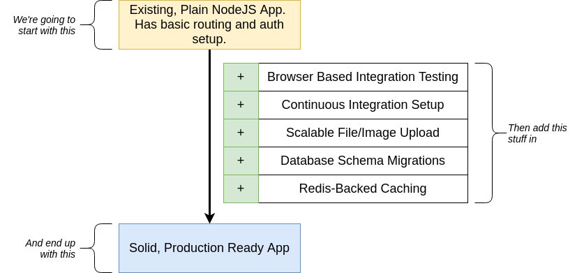
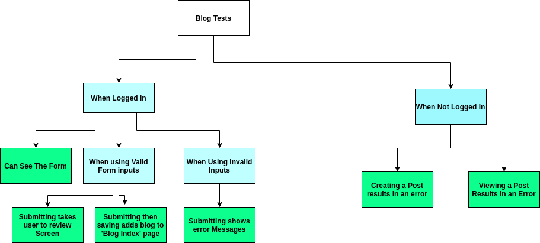
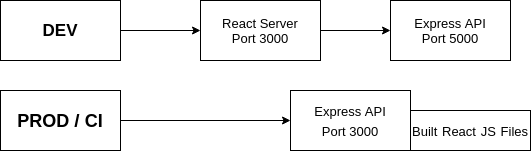
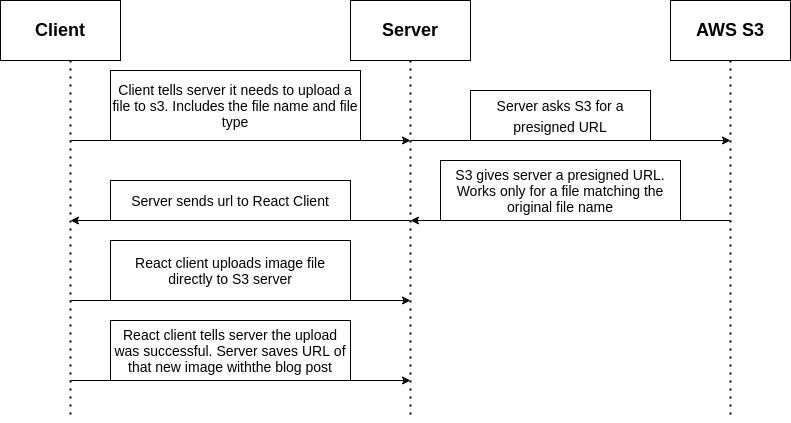

# Advanced Node Project
A sample blog project built with advanced node features such as Caching with Redis, Headless Browser Testing with Puppeteer and Jest and a Continuos Integration Pipeline linked to Travis CI.

This is a README explaining the technical details and processes surrounding the core architecture of the application and the implementation of the aforementioned features.

# Project Breakdown



# Authentication
## The Google OAuth Flow
1. User visits `/auth/google`
2. User is Forwarded to Google from server
3. User enters login, and is redirected back to `/auth/google/callback` on the server
4. Server asks for more details about user from Google
5. Google responds with User profile
6. Server sets cookie on users browser that identifies them
7. All future requests include cookie data that identifies this user

## Operations after someone signs In From Browser
A cookie is automatically sent to Server along with two properties: 
   - session.sig -> Used to ensure session sent to the user wasn't tampered with
   - session -> Server accesses info in session (*User ID*).
   - Server uses the User ID to lookup the user in Database
   - If user exists --> The incoming request belongs to that user
   - If user doesn't exist, assume the user isn't signed in

## Session Flowchart
1. Request goes into middleware (cookie-session)
2. Coookie-session pulls properties 'session' and 'session.sig' off cookie
3. It uses 'session.sig' to ensure 'session' wasn't manipulated.
4. it Decodes 'session' into a JS object
5. Places that Object on 'req.session' which is then passed onto the Passport middleware
   
6. Passport looks at req.session and tries to find 'req.session.passport.user'
7. If an ID is stored there, pass it to 'deserializeUser'
8. Get back a user and assign it to user then pass on the function to the request handler


# Testing
Testing is done using the popular Jest Testing Library

## Testing flow
1. Start React and Express Apps
2. Run 'npm run test'
3. Start Jest Suite
4. Boot up a 'headless' version of chromium
5. Programatically instruct Chromium to visit 'localhost:3000'
6. Programatically instruct Chromium to Click elements on the Screen
7. Make assertion about content on screen

### Challenges
- Launching Chromium programatically and interacting with it from a test suite
- How to make assertions in Jest about stuff that's happening in a Chrome Window
- How to simulate 'logging' in as a user -> Through Google OAuth

Puppeteer -> Starts Up Chromimum
Browser -> Represents an open Browser Window
Page -> Represents one individual Tab

- Launch Chromium
- Navigate to App
- Click on Stuff on Screen
- Use a DOM Selector to retrieve the content of an element
- write assertion to make sure the content is Correct
- REPEAT


### How to Trick Cookie-Session For Authentication Testing
1. Create a Page instance
2. Take an existing user ID and generate a fake session object with it
3. Sign the session object with keygrip
4. Set the Session and signature on our Page instance as cookies

### Test Factories
Two Factories (Helper functions) are used to generate a resource solely for use in testing
- Session Factory
- User Factory

## Blog Tests FlowChart



# Continuous Integration
This is set up to merge all code changes into a single branch on a remote repository
**CI Server**: This will runs automatic checks(tests) on the codebase to ensure changes haven't broken anything

## CI FLOW
1. Developer pushes code to github
2. CI server detects that a new push of code has occured
3. CI server clones project to a cloud-based virtual machine
4. CI server runs all tests
5. If all tests pass, CI Server marks build as 'passing' and does some optional followup
   
This Project uses **Travis CI** to provision a CI server on our behalf

## Server Setup



CI Script is `nohup npm &`
- **nohup:** If the shell is closed, don't kill anything this command creates
- **npm run start:** Run the server
- **&:** Run the server in a subshell (in the background)

CI mode

- Starts up the Express API
- The Expresses server figurs out the address of MongoDB and the Redis Server is

## Server Configuration
1. Add ci.js key file
2. Fix Redis URL in services/cache.js
3. Add Redis URL to dev.js and ci.js
4. Add mongoDB URI to ci.js
5. Make sure server starts on port 3000 in CI mode
6. Make sure server serves react client files in CI mode

# Image Upload
## Big Image Upload Issues
1. Where to physically store the images
2. How images will get to the place they should be stored
3. How to relate images to a particular blog post 
   
## Upload Process Issues
1. Only signed in users should be able to upload
2. The uploaded image needs to be tied to the blog post that's being created
3. Only files ending in image file formats/extensions (.jpg, .png etc) should be uploaded
   
## Image Upload Pipeline


1. From REACT client, issue a GET request to backend API to request a presigned URL
2. Use the presigned URL to upload the file to AWS S3
3. Issue a POST request to backend API to create a blog post.
4. Navigate the user back to the list of blogs
5. Tell the Redux side of the app about the new blog post that was created
   
### Details of the Presigned URL
1. **Domain:** Records the name of the Bucket the data is being uploaded to
2. **File Name:** Name of file being uploaded
3. **AWSAccessKeyID:** The ID/API Key that was used to originally generate the presigned URL
4. **Content-Type:** The type of file that can be uploaded with this link 
5. **Expires:** Time after which link will be obsolete
6. **Signature:** Verifies the link was actually generated by the AWS API. 

### AWS Credentials with IAM
1. 


## Installation
```bash
git clone <url>
npm install
npm run start
```


## Contributing
Pull requests are welcome. For major changes, please open an issue first to discuss what you would like to change.

